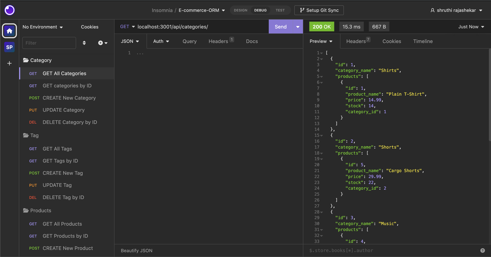

# E-Marketing 
E-Commerce : Object-Relational Mapping (ORM)
## Description
  This application builds an e-commerce site by configuring a working Express.js API to use Sequelize to interact with a MySQL database.

## Tables of content:
  * [Installation](#installation)
  * [Usage](#usage)
  * [License](#license)
  * [Contributors](#contributors)
  * [Test](#test)
  * [Questions](#questions)

## Installation

1. Install NODE.js to run this application
2. Create a .gitignore file and include node_modules/ and .DS_Store/ so that your node_modules directory isn't tracked or uploaded to GitHub. Be sure to create your .gitignore file before installing any npm dependencies.
3. Make sure that your repo includes a package.json with the required dependencies. You can create one by running npm init when you first set up the project, before installing any dependencies.
4. Run command npm install Express from the integrated terminal to install server.js package dependency.
5. Run command  npm install mysql2 from the integrated terminal to install mysql package to connect with database and perfrom queries.
6. Run command npm install sequelize from the integrated terminal install sequelize package to connect Express.js API to a MYSQL database.
7. Run command npm install dotenv from integrated terminal to install dotenv package to use environment variables to store sensitive data like your MySQL username, password, and database name..
8. Use the schema.sql file in the db folder to create  database with MySQL shell commands -  mysql -u root.  
9. Run command node seeda/index.js from integrated terminal to seed tables with data.
10. Application is invoked by using following command: node server.js from integrated terminal.
11. This will start localhost server on PORT 3001.
12. For testing Open insomnia and type http://localhost:3001/ with necessary API routes.

## Usage 
   GIVEN a functional Express.js API
1. WHEN I add my database name, MySQL username, and MySQL password to an environment variable file,
  THEN I am able to connect to a database using Sequelize
2. WHEN I enter schema and seed commands,
  THEN a development database is created and is seeded with test data
3. WHEN I enter the command to invoke the application
  THEN my server is started and the Sequelize models are synced to the MySQL database
4. WHEN I open API GET routes in Insomnia for categories, products, or tags
  THEN the data for each of these routes is displayed in a formatted JSON
5. WHEN I test API POST, PUT, and DELETE routes in Insomnia
  THEN I am able to successfully create, update, and delete data in my database.

## License  
* This application is licensed under : 
* Click the link for the detailed license information: https://choosealicense.com/licenses/isc/

## Contributors
shruthi

## Test
npm test

## Questions
  * GitHub Username : shruthisalimath
  * Email: shruthi@test.com
  * GitHub profile : https://github.com/shruthisalimath 

## Mock Up
   The following animation shows the application's GET routes to return all categories, all products, and all tags being tested in Insomnia:

   
   The following animation shows the application's GET routes to return a single category, a single product, and a single tag being tested in Insomnia:    

   The following animation shows the application's POST, PUT, and DELETE routes for categories being tested in Insomnia:

   

## ScreenShot

## URL
1. Walkthrough video of Employee Tracker.
https://drive.google.com/file/d/1ctHyrqzFwA-eG1hJIhLMM6jsyatEZsMY/view?usp=share_link
  
2. The URL of the GitHub repository.
  https://github.com/shruthisalimath/E-Marketing

